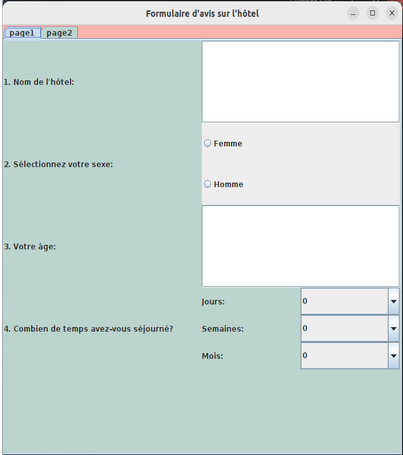

# Java-Swing-project
This is our university project for Java with Swing. This project has been completed by me and my classmates, Nour and Chaker.

The interface of this application provides a user-friendly and functional experience for collecting and analyzing reviews about a hotel. 
The main window accommodates:
* Two clear operations: access the dashboard and fill out a review form. The use of graphical components such as buttons, labels, and a well-positioned hotel image creates a visually appealing presentation.

For the Form Window:

Built with the Swing library, it offers an intuitive interface for entering review details. Questions are logically organized with text fields, radio buttons, checkboxes, and dropdown lists, facilitating the collection of diverse information. The design uses harmonious colors to ensure a pleasant visual experience.

For the Dashboard Window:

Built with the JavaFX library, it offers interactive graphics to visualize review data, including bar charts, pie charts, and line charts. These graphics provide a visual dimension to user opinions' trends and percentages, which will be detailed in the following sections.

Interfaces:

* Homepage Interface:

Created with Java Swing, it welcomes users in a friendly and aesthetically pleasing environment. The Swing library's use offers a clear and organized layout, highlighting the title "Welcome!" with an attractive font. A visually impactful hotel image is integrated using the ImageIcon class. Two interactive buttons are present: "Form" and "Dashboard."

* Form Page:

The first page of the form presents an attractive Java Swing graphical interface for capturing essential information in a user-friendly manner. It solicits the hotel name, followed by a section allowing users to specify their gender and age using JTextField, JRadioButton, and ButtonGroup components. Duration of stay with dropdown menus (JComboBox), seasonal options, purpose of stay, and family presence are also included.

The second page of the form uses Java Swing to present clear visual components for users to specifically evaluate their hotel experience. Radio buttons (JRadioButton) are used for ratings on entertainment, food, cleanliness, and comfort. Dropdown menus (JComboBox) allow selecting satisfaction levels, ensuring structured data collection.

* Administrative Dashboard:

administrative dashboard, designed with JavaFX libraries, offers a clear and concise overview of user review-based analyses. It includes a bar chart illustrating the distribution of reviews between men and women, a pie chart highlighting customer satisfaction with hotel animations, another pie chart focusing on food evaluation, and a line chart providing a dynamic visualization of cleanliness ratings over time. These graphical representations offer administrators a holistic view of customer opinions on key aspects such as demographics, entertainment, food, and cleanliness. The use of JavaFX facilitates the creation of an interactive and aesthetically pleasing interface, enhancing a deep understanding of hotel performance.

